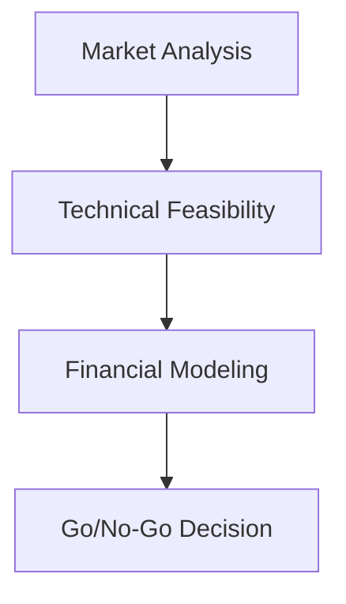
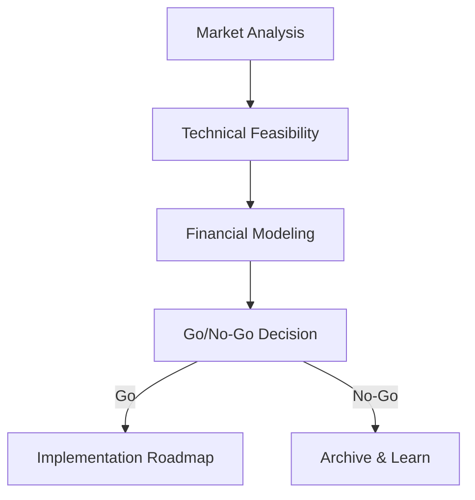

# 전략적 연구 자동화를 위한 Claude Code 가이드라인

## 작업 실행 전략

### 컨텍스트 최적화
작업 및 하위 작업(Task 도구)을 광범위하게 사용하여 컨텍스트 사용을 최적화합니다.

### 병렬 실행
병렬 작업 및 하위 작업(같은 메시지에서 여러 Task 도구 실행)을 광범위하게 사용하여 작업을 더 빠르게 수행합니다.

### Map-Reduce 접근 방식
연구 분해를 위해 병렬 작업 및 하위 작업과 함께 map-reduce 접근 방식을 사용합니다.

### 작업 보고
각 작업 또는 하위 작업이 수행된 작업과 남은 작업(있는 경우)에 대해 매우 간략한 설명을 보고하도록 합니다.

### 문제 해결
작업 또는 하위 작업이 문제에 직면한 경우, **반드시** 필요한 연구 및/또는 실험을 수행하기 위해 다른 [세트의] 하위 작업(들)을 생성해야 합니다.

### 계획 및 추적
광범위하게 계획(TodoWrite 도구 사용)을 사용하여 모든 작업이 철저하고 신뢰할 수 있게 추적되고 아무것도 건너뛰거나 손실되지 않도록 합니다.

### 병렬화 제한
한 번에 병렬로 실행되는 작업 또는 하위 작업의 최대 수는 이 머신의 CPU 코어 수를 초과하지 않아야 합니다.

## 연구 원칙

### 증거 기반 연구
모든 주장은 다음의 신뢰할 수 있는 인용으로 뒷받침되어야 합니다:
- 업계 규정 및 표준
- 학술 연구 및 동료 검토 저널
- 평판 있는 회사의 시장 보고서
- 기술 문서 및 사양
- 전문가 인터뷰(허가 필요)

### 인용 형식
`config/project-config.yml`에 지정된 인용 스타일을 따릅니다(기본값: APA).

### 출처 품질 기준
권위 있는 출처를 우선시합니다:
1. **1차 출처**: 규제 문서, 표준, 공식 사양
2. **2차 출처**: 학술 연구, 업계 보고서, 기술 문서
3. **3차 출처**: 뉴스 기사, 블로그 게시물(드물게 사용, 1차/2차 출처로 검증)

### 교차 참조
내부 일관성 유지:
- 스프린트 내의 다른 작업의 결과 참조
- 관련 연구 파일 연결
- 이전에 확립된 사실 위에 구축

## 품질 기준

### 이중 청중 작성
모든 보고서는 다음 두 가지를 모두 충족해야 합니다:
1. **비즈니스 임원**: 명확한 가치 제안, ROI, 전략적 함의
2. **기술 의사결정자**: 기술적 타당성, 아키텍처 세부 사항, 구현 요구사항

### 문서 구조
모든 연구 파일은 다음을 포함해야 합니다:
- **Executive Summary**: 주요 결과를 요약한 2-3개 단락
- **Key Findings**: 주요 발견 사항의 글머리 목록
- **Supporting Evidence**: 인용이 있는 상세 분석
- **References**: 전체 인용 목록

### 파일 구성
- 스프린트당 최소 25개의 연구 파일(`config/project-config.yml`에서 구성 가능)
- 각 파일은 중점적이고 자체 포함(500-5000단어)
- 명확하고 설명적인 파일명 사용
- 작업별로 파일 구성(01-technical, 02-market, 03-architecture, 등)

## Git 워크플로우

### Pull Request 없음
이것은 단독 연구 워크플로우 - main 브랜치에 직접 커밋합니다.

### 자주 커밋
연구 파일이 완료되면 커밋합니다:
```bash
git add temp/sprint-XX/
git commit -m "Sprint XX, Task YY: [완료된 연구에 대한 간략한 설명]"
git push
```

### 스프린트 마일스톤
각 스프린트 완료 후 git 태그/릴리스를 생성합니다:
```bash
git tag -a sprint-XX-complete -m "Sprint XX: [Sprint Name] - Complete"
git push --tags
```

## 구성 관리

### 프로젝트 구성
모든 프로젝트 설정은 `config/` 디렉토리에 있습니다:
- **project-config.yml**: 프로젝트 메타데이터, 연구 매개변수
- **sprint-config.yml**: 스프린트 정의 및 작업 분류
- **quality-standards.yml**: 증거 요구사항, 품질 임계값
- **scoring-rubric.yml**: 기회 점수 기준
- **glossary.yml**: 업계별 용어

### 환경 변수
민감한 데이터는 `.env`에 저장합니다(커밋하지 않음):
- API 키(ANTHROPIC_API_KEY, 등)
- 외부 서비스 자격 증명
- 런타임 구성 오버라이드

### 컨텍스트 파일
프로젝트별 컨텍스트는 `context/` 디렉토리에 있습니다:
- **company-profile.md**: 회사의 역량, 목표, 제약사항
- **client-info.md**: 클라이언트 배경, 요구사항, 선호도
- **industry-background.md**: 업계별 지식 및 컨텍스트

## 기술 및 명령어

### 기술(모델 호출 에이전트)
Claude Code는 작업 요구사항에 따라 자동으로 기술을 호출합니다:
- **sprint-orchestrator**: 다중 작업 스프린트 실행 조정
- **technical-researcher**: 규제, 기술, 표준 조사
- **market-analyst**: TAM/SAM/SOM, 경쟁자, 고객 분석
- **solution-architect**: 시스템 아키텍처 및 구성요소 설계
- **compliance-analyst**: 인증 경로 및 테스트 연구
- **roadmap-planner**: 구현 로드맵 및 타임라인 생성
- **report-synthesizer**: 점수 매기기와 함께 최종 보고서 종합

### 명령어(사용자 호출)
Claude Code CLI를 통해 명령어 실행:
- `/init-project`: 새 연구 프로젝트 초기화
- `/create-sprint <name>`: 새 스프린트 디렉토리 구조 생성
- `/execute-sprint <id>`: 스프린트의 모든 작업 실행
- `/execute-task <sprint-id> <task-id>`: 단일 작업 실행
- `/synthesize-report <sprint-id>`: 최종 스프린트 보고서 생성
- `/score-opportunity <sprint-id>`: 루브릭을 사용하여 기회 점수 매기기
- `/validate-quality <sprint-id>`: 품질 보증 확인 실행

## 자동화 원칙

### 자율 운영
기술은 자신의 도메인 내에서 자율적으로 운영됩니다:
- 기술은 허가 없이 연구 결정을 내립니다
- 기술은 유익한 경우 연구를 병렬화합니다
- 기술은 포괄적인 연구 파일(요약 아님)을 생성합니다

### 인적 체크포인트
다음의 경우에만 인간의 입력을 위해 중단합니다:
- 전략적 결정(추구할 기회)
- 비즈니스 판단이 필요한 Go/No-Go 추천
- 모호한 요구사항 또는 상충하는 정보
- 예산 또는 타임라인 제약

### 오류 처리
기술이 문제를 만나면:
1. 문제를 명확히 문서화합니다
2. 다른 접근 방식 시도(다양한 출처, 검색 전략)
3. 해결 불가능하면 연구 노트에 플래그하고 계속합니다
4. 자리 표시자 또는 "TODO" 마커를 남기지 않습니다

## 출력 기준

### 연구 파일
- 마크다운 형식으로 작성합니다
- 메타데이터 헤더 포함(제목, 날짜, 저자 기술, 스프린트/작업)
- 명확한 섹션 제목 사용
- 인라인 인용 포함[저자, 연도]
- 끝에 전체 참고 문헌 목록 추가

### 텍스트 형식 및 가독성

#### 일반 원칙
- **밀도 높은 단락 분해** - 글머리 목록, 번호 목록 또는 `<br/>` 태그 사용
- **단락당 최대 3-4개 문장** - 그 이전에 분해 또는 글머리 목록 사용
- **시각적 계층 구조 사용** - 제목, 부제목, 목록으로 시선 유도
- **스캔 가능한 콘텐츠** - 바쁜 임원은 핵심 포인트를 빠르게 파악해야 합니다

#### 밀도 높은 텍스트 - 반드시 목록 또는 줄 바꿈 사용

**예시 - 부정확함(너무 밀집)**:
```markdown
Mega-Trend 1: 자율 주행 실험실(SDL) 상용화 - 시장 성장: 가상 및 원격 실험실 $1.32B(2024) → $3.11B(2033), 10% CAGR - 기술 성숙도: SDL에 대한 학술 출판물이 2015년에서 2024년 사이에 10배 증가했습니다. 비용 감소(3D 인쇄, 오픈소스 하드웨어)가 장벽 낮추기 - 주요 운전자: DOE 투자($1억 이상의 자율 실험 이니셔티브), 민간 부문(Recursion Pharmaceuticals가 약물 발견 SDL을 위해 Strateos 인수), 재료 과학(배터리, 촉매가 빠른 반복 필요) - SRS 기회: 검증된 AI는 SDL 자율 운영을 위한 중요한 활성화제이며, 할루시네이션 위험이 검증되지 않은 AI가 감독되지 않은 상태에서 실행되기에는 너무 높습니다
```

**예시 - 정확함(글머리 목록)**:
```markdown
**Mega-Trend 1: 자율 주행 실험실(SDL) 상용화**

- **시장 성장**: 가상 및 원격 실험실 $1.32B(2024) → $3.11B(2033), 10% CAGR
- **기술 성숙도**: 2015년에서 2024년 사이에 학술 출판물이 10배 증가했습니다; 비용 감소(3D 인쇄, 오픈소스 하드웨어)가 장벽 낮추기
- **주요 운전자**:
  - DOE 투자($1억 이상의 자율 실험 이니셔티브)
  - 민간 부문(Recursion Pharmaceuticals가 Strateos 인수)
  - 재료 과학(배터리, 촉매가 빠른 반복 필요)
- **SRS 기회**: 검증된 AI는 SDL 자율 운영을 위한 중요한 활성화제이며, 할루시네이션 위험이 너무 높음
```

**또는 `<br/>` 태그 포함**:
```markdown
**Mega-Trend 1: 자율 주행 실험실(SDL) 상용화**<br/>
**시장 성장**: 가상 및 원격 실험실 $1.32B(2024) → $3.11B(2033), 10% CAGR<br/>
**기술 성숙도**: 2015년에서 2024년 사이에 학술 출판물이 10배 증가<br/>
**주요 운전자**: DOE 투자($1억 이상), 민간 부문(Recursion이 Strateos 인수), 재료 과학<br/>
**SRS 기회**: 검증된 AI는 중요한 활성화제이며, 할루시네이션 위험이 너무 높음
```

#### 테이블 형식

**중요**: HTML/PDF 렌더링을 위해 올바른 마크다운 테이블 구문이 필요합니다.

**테이블 구조 규칙**:
1. **테이블 앞 빈 줄** - 첫 번째 행 앞에 항상 빈 줄 포함
2. **테이블 뒤 빈 줄** - 마지막 행 뒤에 항상 빈 줄 포함
3. **올바른 마크다운 구문** - 헤더 구분자에 `|` 파이프 및 `|---|` 대시 사용
4. **테이블을 인라인으로 하지 않음** - 각 행을 자체 줄에 배치
5. **열 정렬** - 파이프를 읽기 쉽게 정렬하기 위해 공백 사용

**정확함**:
```markdown
테이블 앞 텍스트.

| Category | Weight | Score |
|----------|--------|-------|
| Market   | 25%    | 93.3  |
| Tech     | 25%    | 80.0  |

테이블 뒤 텍스트.
```

**부정확함**(빈 줄 없음):
```markdown
테이블 앞 텍스트.
| Category | Weight | Score |
|----------|--------|-------|
| Market   | 25%    | 93.3  |
테이블 뒤 텍스트.
```

**셀 내 줄 바꿈**:
- **셀 내 줄 바꿈에는 항상 `<br/>` 태그 사용**
- **테이블에서 마크다운 줄 바꿈에 의존하지 않음**(올바르게 렌더링되지 않음)
- 적절한 줄 바꿈을 사용하여 테이블 셀 콘텐츠를 읽기 쉽게 유지
- 여러 줄 콘텐츠에 HTML 줄 바꿈 사용

**예시 - 정확함**:
```markdown
| Segment | SOM | Customer Count |
|---------|-----|----------------|
| Pharmaceutical R&D | $28M<br/>45% | 50-60<br/>$445K CLV |
| Clinical Labs | $16M<br/>25% | 60-80<br/>$580K CLV |
```

**예시 - 부정확함**:
```markdown
| Segment | SOM | Customer Count |
|---------|-----|----------------|
| Pharmaceutical R&D | $28M | 45% | 50-60 | $445K | 12-24 mo | 40-50% |
```
(열이 너무 많아서 줄 바꿈으로 읽기 어려움)

**규칙**:
1. `<br/>`를 사용하여 긴 셀 콘텐츠를 여러 줄로 나눔
2. 줄 바꿈이 있는 단일 셀에서 관련 데이터 그룹화
3. 가독성을 위해 테이블을 3-5개 열로 제한
4. 데이터가 맞지 않으면 중첩 테이블 또는 여러 테이블 사용
5. 마크다운 뷰어에서 항상 테이블을 미리 보기하여 형식 확인

#### 목록 vs 단락 - 각각 사용 시기

**글머리 목록 사용 대상**:
- 3개 이상의 고유 항목 나열
- 여러 기능/이점 설명
- 복잡한 정보 분해
- 병렬 개념 제시

**번호 목록 사용 대상**:
- 프로세스의 단계
- 순위/우선순위 항목
- 순차적 정보
- 타임라인 이벤트

**단락 사용 대상**:
- 서술적 흐름이 필요한 경우
- 원인과 결과 설명
- 주장 구축
- 콘텐츠가 1-2개 문장

**`<br/>` 태그 사용 대상**:
- 테이블 셀 내
- 줄 바꿈이 필요한 제목 내
- 글머리 목록을 보증하지 않는 짧고 관련된 진술
- 특정 줄 구조 보존

#### 마크다운 목록 구문 - 중요

**수동 번호 매기기 사용 금지** - 밀집된 텍스트로 렌더링되며 실제 목록이 아님.

**부정확함**(단락으로 렌더링):
```markdown
핵심 아키텍처 결정: 1. Verification-First: 공식 검증이 아키텍처의 중심(사후 처리 추가 아님), 사전 보정, 실시간 모니터링 및 사후 보정에서의 검증 게이트 포함 2. 하이브리드 배포: 통합 코드베이스를 사용하여 온프레미스(에어갭 측정 실험실)와 클라우드 SaaS(보정 서비스 제공자) 모두 지원 3. SMT-LIB 표준: 이식성 및 고객 유연성을 위해 모든 보정 모델이 SMT-LIB 2.6 형식
```

**정확함**(적절한 목록으로 렌더링):
```markdown
**핵심 아키텍처 결정**:

1. **Verification-First**: 공식 검증이 아키텍처의 중심(사후 처리 추가 아님), 사전 보정, 실시간 모니터링 및 사후 보정에서의 검증 게이트 포함
2. **하이브리드 배포**: 통합 코드베이스를 사용하여 온프레미스(에어갭 측정 실험실)와 클라우드 SaaS(보정 서비스 제공자) 모두 지원
3. **SMT-LIB 표준**: 이식성 및 고객 유연성을 위해 모든 보정 모델을 SMT-LIB 2.6 형식
```

**마크다운 목록 규칙**:
1. **목록 앞 빈 줄** - 첫 번째 항목 앞에 항상 빈 줄 포함
2. **올바른 구문** - 번호 목록에는 `1. `, 글머리 목록에는 `- ` 사용
3. **번호를 인라인으로 하지 않음** - 한 줄에 "1. Item 2. Item" 작성 금지
4. **레이블을 굵게** - 강조하기 위해 `**Label**:` 사용
5. **한 줄에 하나의 항목** - 각 목록 항목을 자체 줄에 배치

### 다이어그램 및 시각화

#### 항상 Mermaid 사용
- **모든 시각적 표현에 Mermaid 다이어그램을 항상 사용합니다**
- **다이어그램에 ASCII 아트를 절대 사용하지 않습니다**(읽기 어렵고 전문성 떨어짐)
- Mermaid는 다음을 지원합니다: 흐름도, 시퀀스 다이어그램, 클래스 다이어그램, 상태 다이어그램, ER 다이어그램, Gantt 차트, 원형 차트 등
- 장점: 깔끔함, 전문적, 확장 가능, 유지보수 가능, 마크다운 뷰어에서 아름답게 렌더링됨

#### Mermaid 레이블 인용 - 중요
**Mermaid 다이어그램의 레이블을 항상 인용하여** 렌더링 오류를 방지합니다.

**예시 - 부정확함(렌더링될 수 없음)**:

문제: 특수 문자, 공백 또는 예약어가 렌더링을 깨뜨릴 수 있음

**예시 - 정확함(항상 작동)**:


**인용 규칙**:
1. **모든 노드 레이블 주위에 큰따옴표 항상 사용**: `A["Label"]`
2. **모든 엣지 레이블 인용**: `-->|"Label"|`
3. **간단한 레이블도 인용**: `A["Start"]`(아님: `A[Start]`)
4. **레이블의 큰따옴표 이스케이프**: `A["Quote: \"text\""]`
5. **모든 다이어그램 유형에 큰따옴표 사용**: 흐름도, 시퀀스, 클래스 등

**중요한 이유**:
- Mermaid 구문 분석 오류 방지
- 특수 문자(괄호, 큰따옴표, 콜론 등) 처리
- 예약어 충돌 회피
- 모든 뷰어(GitHub, HTML, PDF)에서 다이어그램 렌더링 보장

#### 일반적인 Mermaid 사용 사례
- 시스템 아키텍처 → Mermaid 흐름도 또는 C4 다이어그램
- 데이터 흐름 → Mermaid 흐름도 또는 시퀀스 다이어그램
- 프로세스 워크플로 → Mermaid 흐름도 또는 상태 다이어그램
- 데이터베이스 스키마 → Mermaid ER 다이어그램
- 프로젝트 타임라인 → Mermaid Gantt 차트
- 구성요소 관계 → Mermaid 클래스 또는 구성요소 다이어그램

#### Mermaid 다이어그램을 사용한 PDF 내보내기
`mermaid-filter`가 설치되면 Mermaid 다이어그램이 PDF 내보내기에서 자동으로 렌더링됩니다:
- 설치: `npm install -g @mermaid-js/mermaid-cli mermaid-filter`
- 다이어그램이 PDF의 포함된 이미지로 변환됨
- 필터 없음: 다이어그램이 코드 블록으로 나타남(렌더링 아님)
- CI/CD: GitHub Actions 워크플로에서 필터 자동 설치

### 최종 보고서
- 이해관계자 프레젠테이션에 적합한 전문적 형식
- Executive Summary(1-2페이지)
- 상세 결과(복잡도에 따라 10-30페이지)
- 지원 데이터를 위한 부록
- 여러 형식으로 내보내기(마크다운, PDF, DOCX)

### 제공 물품
각 스프린트는 다음을 생성합니다:
- `temp/sprint-XX/`의 연구 파일
- `reports/sprint-XX-final-report.md`의 최종 보고서
- 기회 점수(0-100) 분류 포함
- Go/No-Go 추천(정당성 포함)
