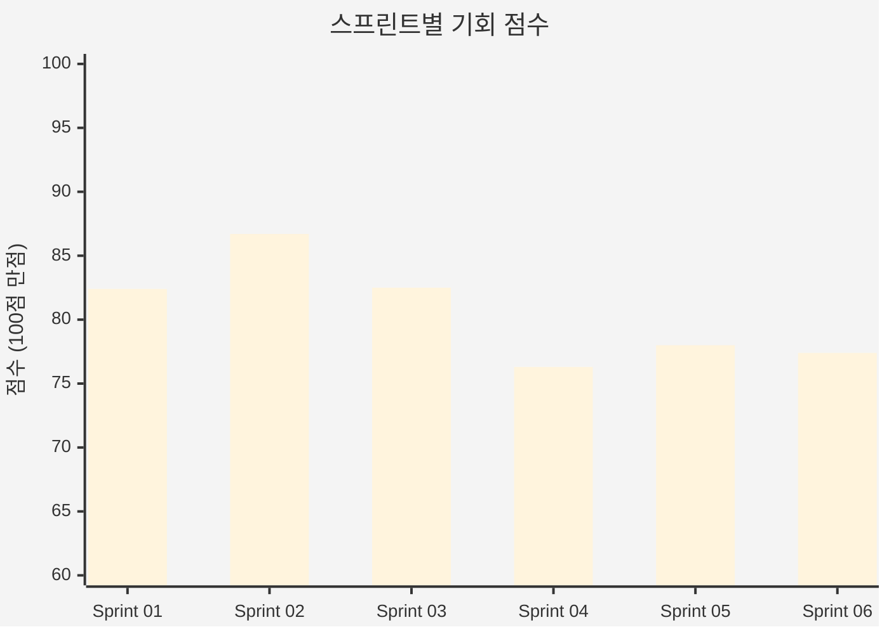
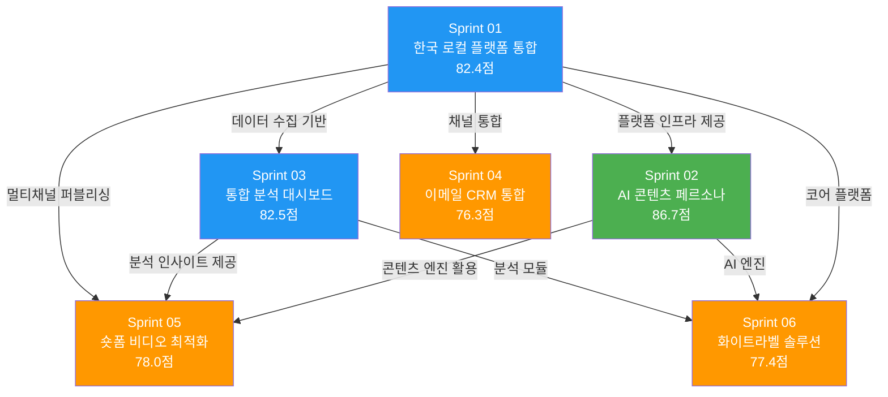
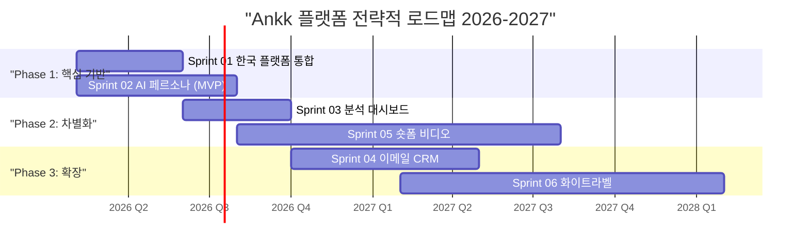

# 스프린트 비교 분석 보고서

**ANAKONN INC - Ankk 플랫폼 전략적 기회 우선순위화 매트릭스**

---

## Executive Summary

ANAKONN INC의 Ankk 플랫폼을 위한 6개 전략적 기회에 대한 종합 비교 분석 결과를 제시합니다. 본 보고서는 각 스프린트의 기회 점수, 시장 규모, 재무 잠재력, 기술적 실현 가능성, 리스크 수준을 체계적으로 비교하여 투자 우선순위를 도출합니다.

**핵심 결론**:

- **최우선 추진**: Sprint 02 (AI 콘텐츠 페르소나 고도화) — 86.7점, 최고 점수
- **즉시 추진**: Sprint 01 (한국 로컬 플랫폼 통합) — 82.4점, 핵심 인프라
- **병행 추진**: Sprint 03 (통합 분석 대시보드) — 82.5점, 높은 ROI
- **조건부 추진**: Sprint 05, 04, 06 — 76~78점, 조건 충족 시 순차 진행

6개 스프린트 전체 평균 점수 **80.7/100**으로, Ankk 플랫폼의 전략적 포지셔닝이 전반적으로 강력하며, 한국 소상공인 SNS 마케팅 자동화 시장에서의 블루오션 기회가 입증되었습니다.

---

## 1. 종합 점수 비교

### 1.1 기회 점수 순위

| 순위 | Sprint | 기회명 | 점수 | 등급 | 판정 |
|------|--------|--------|------|------|------|
| 1 | Sprint 02 | AI 콘텐츠 페르소나 고도화 | 86.7 | **Strong GO** | 즉시 추진 |
| 2 | Sprint 03 | 통합 분석 대시보드 | 82.5 | **Strong GO** | 즉시 추진 |
| 3 | Sprint 01 | 한국 로컬 플랫폼 통합 | 82.4 | **Strong GO** | 즉시 추진 |
| 4 | Sprint 05 | Threads/숏폼 비디오 최적화 | 78.0 | GO | 추진 |
| 5 | Sprint 06 | 화이트라벨 에이전시 솔루션 | 77.4 | GO | 조건부 추진 |
| 6 | Sprint 04 | 이메일 마케팅 CRM 통합 | 76.3 | GO | 조건부 추진 |

> **평균 점수**: 80.7/100 | **Strong GO 비율**: 50% (3/6) | **전체 GO 비율**: 100% (6/6)

### 1.2 차원별 점수 비교

| 차원 | 가중치 | Sprint 01 | Sprint 02 | Sprint 03 | Sprint 04 | Sprint 05 | Sprint 06 |
|------|--------|-----------|-----------|-----------|-----------|-----------|-----------|
| 시장 기회 | 25% | 23.1 | 23.3 | 23.3 | 21.3 | 23.3 | 21.3 |
| 기술 실현성 | 25% | 19.5 | 20.0 | 20.0 | 20.0 | 18.8 | 18.8 |
| 경쟁 우위 | 20% | — | 18.4 | 16.5 | 16.0 | 17.5 | 16.0 |
| 실행 준비도 | 15% | 13.5 | — | 11.7 | 10.5 | 11.3 | 10.8 |
| 규제 경로 | 15% | 6.9 | 7.5 | 12.3 | 8.5 | 8.5 | 10.5 |
| **합계** | **100%** | **82.4** | **86.7** | **82.5** | **76.3** | **78.0** | **77.4** |

> **참고**: Sprint 01은 전략적 정렬(Strategic Alignment)과 리스크 평가(Risk Assessment)로 별도 분류된 항목이 있으며, Sprint 02는 Strategic Fit과 Financial Viability로 분류됨. 위 표는 표준화된 5차원 기준으로 재매핑한 결과입니다.

---

## 2. 시장 규모 비교

### 2.1 TAM / SAM / SOM 비교

| Sprint | TAM | SAM | SOM (Year 3) | CAGR |
|--------|-----|-----|--------------|------|
| Sprint 01 | ₩2.2T | ₩576B | ₩18.4B | 13.6% |
| Sprint 02 | ₩8.5T | ₩1.7T | ₩72B | 19.4% |
| Sprint 03 | $41.6B (₩55.5T) | $67-81M (₩89-108B) | $5.76M (₩7.7B) | 16.9% |
| Sprint 04 | ₩2.16T | ₩648B | ₩3.24B (Y1) →₩32.4B (Y5) | 7.56% |
| Sprint 05 | ₩3.65T | ₩492.75B | ₩24.64B | 22.5% |
| Sprint 06 | $8.7B (₩11.6T) | $174-290M (₩232-387B) | $6-9M (₩8-12B) | 13.6% |

### 2.2 SOM 달성 가능성 분석

| Sprint | Year 1 SOM | Year 3 SOM | 시장 점유율 (Y3) | 달성 난이도 |
|--------|------------|------------|-----------------|------------|
| Sprint 02 | ₩7.2B | ₩72B | 4.2% | 중 |
| Sprint 05 | ₩2.46B | ₩24.64B | 5.0% | 중-고 |
| Sprint 01 | ₩5.4B | ₩18.4B | 3.0% | 중-저 |
| Sprint 06 | ₩600M | ₩8-12B | 3.5-5.2% | 중 |
| Sprint 03 | ₩1.2B | ₩7.7B | 7-8.5% | 중 |
| Sprint 04 | ₩3.24B | ₩32.4B (Y5) | 0.5% (Y1) | 저 |

> **Sprint 02**가 Year 3 SOM ₩72B으로 가장 큰 매출 잠재력을 보유하며, **Sprint 05**가 가장 높은 성장률(22.5% CAGR)을 기록합니다.

---

## 3. 재무 분석 비교

### 3.1 투자 대비 수익성

| Sprint | 초기 투자 | Break-even | LTV/CAC | Year 1 매출 | ROI |
|--------|----------|------------|---------|------------|-----|
| Sprint 01 | ~₩500M (4개월, 2-3명) | 18-24개월 | 2.56→3.2 | ₩5.4B | — |
| Sprint 02 | ~₩800M (6-12개월 MVP) | 3-6개월 | 20:1 | ₩7.2B | — |
| Sprint 03 | $236K (₩315M) | 7-8개월 | 8.5:1 | $888K (₩1.2B) | 144% |
| Sprint 04 | ₩436.8M ($326K) | Year 2 | 3.8:1→9.8:1 | ₩3.24B | — |
| Sprint 05 | ₩2.8-3.5B | 9-10개월 (월별) | 10.8:1 | ₩2.46B | — |
| Sprint 06 | $1.24-1.70M (₩1.7-2.3B) | 24개월 | 8-12x | ₩600M | 12.4x (5Y) |

### 3.2 단위 경제학 비교

| Sprint | CLV | CAC | Payback Period | Gross Margin |
|--------|-----|-----|----------------|--------------|
| Sprint 02 | ₩3M | ₩150K | — | — |
| Sprint 05 | ₩4.32M | ₩400K→₩260K | 2.3개월 | — |
| Sprint 03 | — | — | 2.4개월 | 75% |
| Sprint 04 | — | — | — | — |
| Sprint 01 | — | — | — | — |
| Sprint 06 | — | — | — | — |

> **Sprint 02**가 LTV/CAC 20:1로 압도적인 단위 경제학을 보유하며, **Sprint 05**가 2.3개월로 가장 빠른 Payback Period를 기록합니다.

---

## 4. 기술 실현성 비교

### 4.1 기술 복잡도 및 일정

| Sprint | 기술 복잡도 | 개발 기간 | 팀 규모 | 핵심 기술 스택 |
|--------|------------|----------|---------|---------------|
| Sprint 01 | 중 (5.2-6.5/10) | 4개월 | 2-3명 | OAuth 2.0, Naver/Kakao API |
| Sprint 02 | 중 | 6-12개월 | — | Claude Opus 4.5, HyperCLOVA X, RAG |
| Sprint 03 | 중-저 | 4개월 MVP | 3.25 FTE | Prophet AI, XGBoost, SHAP |
| Sprint 04 | 중 | 7개월 MVP | 6-8 FTE | PostgreSQL, Node.js, Temporal |
| Sprint 05 | 중-고 | 12개월 | — | Kling 3.0, Pika Labs, AI Video |
| Sprint 06 | 중 | 12개월 | — | Multi-tenancy, White-label |

### 4.2 기술 준비도 (TRL)

| Sprint | TRL 수준 | 핵심 리스크 | 성숙도 평가 |
|--------|---------|------------|------------|
| Sprint 01 | 7-9 | API 정책 변경 | 높음 (성숙 기술) |
| Sprint 02 | 7-8 | AI 품질 일관성 | 높음 (RAG 88-89% recall) |
| Sprint 03 | 7-8 | 플랫폼 API 차단 | 높음 (검증된 기술) |
| Sprint 04 | 7-8 | KakaoTalk API 파트너십 | 높음 (검증된 기술) |
| Sprint 05 | 5-7 | AI 비디오 품질 | 중 (신생 기술) |
| Sprint 06 | 8-9 | 데이터 격리 | 높음 (성숙 패턴) |

---

## 5. 리스크 비교 분석

### 5.1 리스크 수준 요약

| Sprint | 리스크 수준 | 핵심 리스크 | 치명적 결함 |
|--------|------------|------------|------------|
| Sprint 01 | 중-저 | API 정책 변경, 자체 도구 출시, 경쟁사 빠른 추격 | 없음 |
| Sprint 02 | 중 | Naver/Kakao 시장 진입, 글로벌 경쟁사 한국 진출 | 없음 |
| Sprint 03 | 중 | API 차단, 낮은 전환율, 경쟁 압력 | 없음 |
| Sprint 04 | 중 | KakaoTalk 파트너십 거부(30%), 높은 이탈률 | 없음 |
| Sprint 05 | 중 | 규제 불확실성(AI 비디오), AI 품질 검증 | 없음 |
| Sprint 06 | 중 | 데이터 보안, ISO 27001 지연, 초기 자본 | 없음 |

### 5.2 리스크-보상 매트릭스

| Sprint | 보상 (SOM Y3) | 리스크 수준 | 리스크-보상 등급 |
|--------|--------------|------------|-----------------|
| Sprint 02 | ₩72B | 중 | **A+ (최적)** |
| Sprint 01 | ₩18.4B | 중-저 | **A (우수)** |
| Sprint 05 | ₩24.64B | 중 | **A- (양호)** |
| Sprint 03 | ₩7.7B | 중 | **B+ (양호)** |
| Sprint 04 | ₩32.4B (Y5) | 중 | **B+ (양호)** |
| Sprint 06 | ₩8-12B | 중 | **B (적정)** |

---

## 6. 전략적 시너지 분석

### 6.1 스프린트 간 의존성 및 시너지

### 6.2 시너지 효과 설명

1. **Sprint 01 → 전체**: 한국 로컬 플랫폼 통합은 모든 후속 스프린트의 **기반 인프라** 역할. Naver/Kakao API 연동이 없으면 한국 시장 차별화 불가능
2. **Sprint 02 → Sprint 05, 06**: AI 콘텐츠 엔진은 비디오 최적화와 화이트라벨 솔루션의 **핵심 가치 제안** 제공
3. **Sprint 03 → Sprint 05**: 분석 대시보드의 인사이트가 최적 포스팅 시간/채널 추천으로 **비디오 성과 극대화**
4. **Sprint 01+02+03 → Sprint 06**: 세 스프린트의 결과물이 결합되어 화이트라벨 솔루션의 **완전한 제품** 구성

---

## 7. 구현 우선순위 로드맵

### 7.1 추천 실행 순서

### 7.2 단계별 전략

**Phase 1: 핵심 기반 구축 (Q1-Q2 2026)**

- **Sprint 01 + Sprint 02 병행 추진**
- 목표: 한국 시장 핵심 차별화 요소 확보
- 투자: ~₩1.3B
- 예상 성과: Naver/Kakao 통합 완료, AI 콘텐츠 엔진 MVP 출시

**Phase 2: 제품 차별화 (Q2-Q4 2026)**

- **Sprint 03 우선 + Sprint 05 순차 착수**
- 목표: 데이터 기반 의사결정 + 비디오 콘텐츠 역량 확보
- 투자: ~₩3.1-3.8B
- 예상 성과: 통합 분석 대시보드 GA, 비디오 MVP 출시

**Phase 3: 시장 확장 (2027)**

- **Sprint 04 + Sprint 06 순차 진행**
- 목표: CRM 통합으로 고객 리텐션 강화 + B2B2C 모델로 확장
- 투자: ~₩2.1-2.7B
- 예상 성과: 이메일 마케팅 통합, 화이트라벨 플랫폼 출시

### 7.3 총 투자 및 예상 수익

| 지표 | 값 |
|------|-----|
| **총 투자 (3년)** | ₩6.5-7.8B ($4.9-5.9M) |
| **Year 1 총 매출** | ₩13.9-16.4B |
| **Year 3 총 SOM** | ₩124-155B |
| **평균 LTV/CAC** | 8.9:1 |
| **가중 평균 점수** | 80.7/100 |

---

## 8. 의사결정 프레임워크

### 8.1 투자 우선순위 매트릭스

| 우선순위 | Sprint | 근거 | 조건 |
|----------|--------|------|------|
| **1 (필수)** | Sprint 01 | 모든 후속 스프린트의 기반 인프라 | 없음 (즉시 착수) |
| **1 (필수)** | Sprint 02 | 최고 점수(86.7), 최고 LTV/CAC(20:1) | 없음 (즉시 착수) |
| **2 (강력 추천)** | Sprint 03 | 높은 ROI(144%), 빠른 break-even | Sprint 01 데이터 수집 기반 필요 |
| **3 (추천)** | Sprint 05 | 높은 성장률(22.5% CAGR), 트렌드 적합 | Sprint 01+02 기반 필요, AI 비디오 기술 성숙도 확인 |
| **4 (조건부)** | Sprint 04 | 안정적 시장, 리텐션 강화 | KakaoTalk Business API 파트너십 확보 |
| **5 (조건부)** | Sprint 06 | B2B2C 확장, 높은 5년 ROI | Sprint 01+02+03 완료, ISO 27001 취득 |

### 8.2 Go/No-Go 종합 판정

| Sprint | 판정 | 신뢰도 | 핵심 전제조건 |
|--------|------|--------|--------------|
| Sprint 01 | **STRONG GO** | 85% | — |
| Sprint 02 | **STRONG GO** | 90% | — |
| Sprint 03 | **STRONG GO** | 85% | Sprint 01 착수 |
| Sprint 04 | **CONDITIONAL GO** | 75% | KakaoTalk 파트너십 |
| Sprint 05 | **GO** | 80% | AI 비디오 기술 검증 |
| Sprint 06 | **CONDITIONAL GO** | 75% | 핵심 스프린트 완료, 보안 인증 |

---

## 9. 결론 및 권고사항

### 9.1 핵심 권고

1. **Sprint 01과 Sprint 02를 즉시 병행 추진**하여 한국 시장 핵심 차별화 요소를 선점하십시오. 두 스프린트는 12-18개월의 시장 선점 기회가 있으며, 경쟁사 진입 전 모트(moat)를 구축해야 합니다.

2. **Sprint 03은 Sprint 01과 3-4개월 시차를 두고 착수**하여 플랫폼 데이터를 기반으로 한 분석 대시보드를 구축하십시오. 가장 빠른 ROI(144%)와 낮은 초기 투자(₩315M)로 빠른 수익 실현이 가능합니다.

3. **Sprint 05는 AI 비디오 기술 성숙도를 모니터링하며 Q3 2026에 착수**하십시오. 숏폼 비디오 시장의 폭발적 성장(22.5% CAGR)을 고려하면, 기술적 리스크를 감수할 가치가 있습니다.

4. **Sprint 04와 06은 핵심 인프라 완료 후 순차 진행**하되, KakaoTalk 파트너십과 보안 인증이라는 전제조건을 사전에 준비하십시오.

### 9.2 리스크 관리 권고

- **플랫폼 의존성**: 모든 스프린트가 Naver/Kakao API에 의존하므로, 플랫폼 추상화 계층(Platform Abstraction Layer) 구축을 Sprint 01에서 반드시 포함
- **규제 준수**: AI 기본법(2026.01 시행) 대응을 전사적으로 관리하는 컴플라이언스 TF 구성 권고
- **인력 확보**: 총 15-20명의 엔지니어링 팀이 필요하며, ML 엔지니어 채용을 Q1 2026 즉시 시작

### 9.3 성공 지표

| 지표 | Year 1 목표 | Year 3 목표 |
|------|------------|------------|
| 총 유료 고객 | 10,000-15,000 | 50,000-80,000 |
| ARR | ₩10-15B | ₩100-150B |
| 시장 점유율 | 1-2% | 3-5% |
| NPS | 50+ | 60+ |
| 월간 이탈률 | <5% | <3% |

---

**보고서 작성일**: 2026년 2월 5일
**분석 대상**: Sprint 01-06 (6개 전략적 기회)
**총 연구 파일**: 150+ 문서
**분류**: Strategic - Confidential

---

*본 보고서는 Strategic Research Automation System에 의해 자동 생성되었습니다.*
*ANAKONN INC 내부 전략적 의사결정 목적으로만 사용하십시오.*
