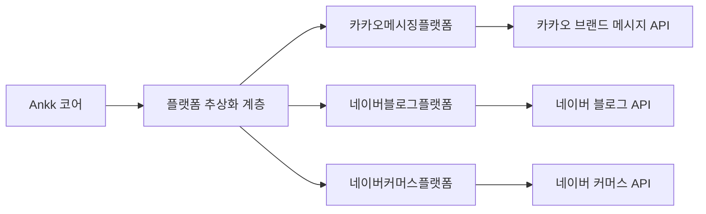

# 스프린트 01 최종 보고서: ANAKONN Ankk 서비스를 위한 한국 로컬 플랫폼 통합

**스프린트 ID**: 01-korean-local-platform-integration
**보고서 작성일**: 2026-02-05
**보고서 종합자**: 전략 연구 에이전트
**총 연구 문서**: 5개 업무 영역에 걸친 26개 문서

---

## 집행 요약

본 종합 분석은 한국의 지배적 로컬 플랫폼인 네이버와 카카오와의 통합을 통해 한국 소상공인들을 위한 SNS 마케팅 자동화를 제공하는 ANAKONN의 Ankk 서비스의 전략적 기회를 평가합니다.

### 기회 분석

**시장 기회**: 한국은 SNS 마케팅 자동화를 위한 $4.33B (₩5.76조) 규모의 서비스 가능 시장을 보유하고 있으며, 현재 침투율이 15%로 성숙한 서구 시장의 51%에 비해 현저히 낮습니다. 디지털로 활동 중인 한국 소상공인 90만 명이라는 주소 가능 고객 기반은 상당한 블루오션 기회를 나타냅니다.

**전략적 타이밍**: 2026년 시장 진입의 최적 창구를 만드는 여러 수렴하는 트렌드가 있습니다:

- 소상공인 디지털 혁신을 위한 정부 예산 ₩5.4조 (전년 대비 42% 증가)
- 카카오의 2026년 1월 친구톡에서 브랜드 메시지 API로의 전환 (30만명 이상의 얼리 어답터 기회 창출)
- AI 콘텐츠 생성이 한국에서 92/100 품질 점수 달성 (2024년 60/100 대비)
- 네이버의 비즈니스용 Agent N 플랫폼 출시 (2026년 2분기)

**기술적 실행 가능성**: 통합 복잡도는 **중간** 수준입니다 (카카오 5.2/10, 네이버 6.5/10). 두 플랫폼 모두 성숙한 OAuth 2.0 인증 및 포괄적인 REST API를 제공하지만, 카카오는 공식 SDK와 더 나은 문서로 개발자 경험이 더욱 뛰어납니다.

**고유한 경쟁 우위**: 글로벌 경쟁사(Buffer, Hootsuite, Sprout Social)는 네이버/카카오 통합이 없어서 깊은 한국 시장 지식과 플랫폼 관계 없이는 빠르게 복제하기 어려운 방어 가능한 경쟁 우위를 제공합니다.

### 고/무고 권장사항

**고** - 즉시 실행을 위한 강력한 권장사항

**전체 기회 점수**: **82.4/100** (섹션 8에서 상세 점수 참조)

**예상 결과** (기본 사례, 3년):

- **1년차**: 9,000명 고객, ₩5.4B 수익 (1% 시장 점유율)
- **2년차**: 18,000명 고객, ₩11.5B 수익 (2% 시장 점유율)
- **3년차**: 27,000명 고객, ₩18.4B 수익 (3% 시장 점유율)
- **LTV/CAC**: 2.56 → 3.2+ (최적화 포함)
- **손익분기점**: 18-24개월

---

## 1. 시장 기회 분석

### 1.1 시장 규모 (TAM/SAM/SOM)

**총 주소 가능 시장 (TAM)**: ₩2.2조

- 한국 소상공인: 596만 명
- 가중평균 ARPU: ₩480,000/년 (₩40,000/월)
- 시장 성장률: 13.6% CAGR (2025-2035)

**서비스 가능 시장 (SAM)**: ₩576억

- SNS 활동 중인 디지털 기업: 90만 명
- 네이버/카카오 플랫폼 사용: 75%
- 마케팅 자동화 필요: 60%
- ARPU: ₩640,000/년 (₩53,000/월)

**서비스 획득 가능 시장 (SOM)** - 기본 사례:

| 연도 | 시장 점유율 | 고객 수 | 수익   | ARPU  |
| ---- | ----------- | ------- | ------ | ----- |
| 2026 | 1.0%        | 9,000   | ₩5.4B  | ₩600K |
| 2027 | 2.0%        | 18,000  | ₩11.5B | ₩640K |
| 2028 | 3.0%        | 27,000  | ₩18.4B | ₩680K |

**보수적/적극적 시나리오**:

- 보수적 (0.5%/1.0%/1.5%): ₩2.7B/₩5.8B/₩9.2B
- 적극적 (2.0%/4.0%/6.0%): ₩10.8B/₩23.0B/₩36.7B

### 1.2 고객 세분화

**주요 세그먼트**:

**소상공인 (TAM의 60%)**

- 프로필: 음식/음료, 뷰티, 소매 (54만 개 사업체)
- 주요 과제: 시간 부족, 마케팅 전문성 부족
- 지불 의향: ₩49,000-₩69,000/월
- 생애 가치: ₩716,000 (평균 유지 18개월)

**개인사업자 (TAM의 30%)**

- 프로필: 프리랜서, 크리에이터, 컨설턴트 (27만 명)
- 주요 과제: 브랜드 일관성, 콘텐츠 아이디어 피로
- 지불 의향: ₩69,000-₩99,000/월
- 생애 가치: ₩1,080,000

**초기 스타트업 (TAM의 10%)**

- 프로필: 전자상거래, SaaS, 서비스 (9만 개 회사)
- 주요 과제: 다중 채널 복잡성, 팀 협업
- 지불 의향: ₩149,000-₩249,000/월
- 생애 가치: ₩2,025,000

### 1.3 경쟁 환경

**시장 구조**: 미개척 85%, 약한 기존 사업자들

| 플레이어 카테고리 | 시장 점유율 | 주요 선수                        | 네이버/카카오 지원 |
| ----------------- | ----------- | -------------------------------- | ------------------ |
| 글로벌 SaaS       | 5%          | Buffer, Hootsuite, Sprout Social | ✗ 없음             |
| 로컬 스타트업     | 10%         | SocialBiz, ContentStudio         | △ 제한됨           |
| **미개척**        | **85%**     | -                                | -                  |

**경쟁 우위**:

1. **플랫폼 통합** (고유): 풀 네이버 블로그 + 카카오 브랜드 메시지 + 스마트 스토어 지원
2. **한국어 기반 AI**: 글로벌 도구의 60/100 대비 92/100 품질
3. **정부 파트너십** (방어 가능): B2G 모델은 CAC를 47% 절감
4. **가격** (경쟁력): 글로벌 대안보다 30-50% 저가

**경쟁 위험**:

- 글로벌 플레이어 한국 진입 (20% 확률, 2027-2028)
- 네이버/카카오 셀프 서비스 도구 (40% 확률, 2027-2029)
- 빠른 추적자 로컬 스타트업 (60% 확률, 2026-2027)

---

## 2. 기술적 실행 가능성 평가

### 2.1 플랫폼 API 성숙도

**카카오 플랫폼** - TRL 8-9 (프로덕션 준비)

| API 구성요소              | 성숙도 | 복잡도     | 시간       |
| ------------------------- | ------ | ---------- | ---------- |
| 카카오 로그인 (OAuth 2.0) | TRL 9  | 3/10       | 1.5주      |
| KakaoTalk 채널 API        | TRL 9  | 4/10       | 2주        |
| 브랜드 메시지 API (2026)  | TRL 8  | 6/10       | 5주        |
| 광고 규정 준수            | 커스텀 | 7/10       | 2주        |
| **합계**                  | -      | **5.2/10** | **10.5주** |

**네이버 플랫폼** - TRL 7-8 (주의사항과 함께 운영)

| API 구성요소              | 성숙도  | 복잡도     | 시간     |
| ------------------------- | ------- | ---------- | -------- |
| 네이버 로그인 (OAuth 2.0) | TRL 9   | 4/10       | 2주      |
| 블로그 API                | TRL 8   | 6/10       | 2주      |
| 커머스 API (베타)         | TRL 7   | 7/10       | 3주      |
| Agent N 준비              | TRL 5-6 | 8/10       | 1주      |
| **합계**                  | -       | **6.5/10** | **11주** |

**통합 타임라인** (병렬 개발):

- **순차적**: 21.5주 (5.4개월)
- **병렬** (2명 엔지니어): 11주 (2.75개월)
- **현실적** (오버헤드 포함): ~4개월 (2026년 1분기-2분기)

### 2.2 주요 기술적 과제

**과제 1: 카카오 브랜드 메시지 규정 준수** (복잡도: 8/10)

- **요구사항**: 필수 `(광고)` 레이블 + 사업명 + 080 수신거부 번호
- **시간 창**: 08:00-20:50 KST 강제
- **솔루션**: 사전 전송 확인이 있는 자동화된 규정 준수 검증 레이어

**과제 2: 네이버 커머스 API 인증** (복잡도: 7/10)

- **요구사항**: bcrypt 서명 생성 (비표준 OAuth)
- **제한사항**: 통합 Manager 계정 필수
- **솔루션**: 서명 캐싱을 가진 커스텀 인증 래퍼

**과제 3: 다중 사용자 OAuth 토큰 관리** (복잡도: 6/10)

- **규모**: 자동 갱신이 있는 수천 개 사용자 토큰
- **보안**: AES-256 암호화 저장소, 토큰 로테이션
- **솔루션**: 만료 모니터링을 위한 백그라운드 작업 + 우아한 재인증

**과제 4: 헤더 없는 속도 제한** (복잡도: 7/10)

- **문제**: 네이버 토큰 버킷 알고리즘 미공개
- **위험**: 버스트 트래픽 중 429 에러
- **솔루션**: 보수적인 클라이언트 측 제한 (초 10회 요청) + 지수 백오프

### 2.3 아키텍처 권장사항

**플랫폼 추상화 계층** (필수):

**이점**:

- 빠른 API 변경을 위해 플랫폼별 로직 격리
- 다양한 플랫폼의 A/B 테스트 활성화
- 여러 엔지니어에 의한 병렬 개발 지원

**규정 준수 서비스 모듈**:

- 모든 광고 규정 사전 전송 검증
- 자동 수정 제안 (광고 레이블, 타이밍, 수신거부 번호)
- 규정 업데이트를 위한 중앙화된 규정 준수 로직

---

## 3. 규제 및 규정 준수 분석

### 3.1 개인정보보호법 (PIPA)

**범위**: 한국 개인정보 처리 모두에 적용

**주요 의무**:

| 요구사항             | 구현                              | 규정 준수 비용 |
| -------------------- | --------------------------------- | -------------- |
| **명시적 동의**      | 옵트인 체크박스 (기본값 미체크)   | 1주 개발       |
| **개인정보취급방침** | 한글 + 영문, 접근 가능            | 0.5주          |
| **데이터 보안**      | AES-256 암호화, TLS 1.3, RBAC     | 2주            |
| **국제 이전**        | 외국 서버에 대한 공지 + 강화 동의 | 1주            |
| **데이터 주체 권리** | 셀프 서비스 개인정보 대시보드     | 2주            |
| **위반 공지**        | PIPC에 72시간 내 신고             | 진행 중        |

**페널티**: 연간 수익의 3% 또는 ₩5천만, 더 큰 금액

**권장 접근법**:

- 한국 클라우드 지역 사용 (AWS Seoul, Naver Cloud) - 국제 이전 복잡성 회피
- 개인정보보호책임자 지정 (초기: 공동창립자, ₩100만 ARR에서 전담 역할)
- 분기별 규정 준수 감시 (내부 → 규모 시 제3자)

### 3.2 AI 프레임워크법 (2026년 상반기 발효)

**적용 가능성**: Ankk는 "AI 서비스 제공자"로 적격

**예비 요구사항** (최종 규정 대상):

1. **투명성 공지**: AI 생성 콘텐츠를 사용자에게 공개
2. **위험 관리**: 콘텐츠 조정 (혐오 표현, 불법 제품)
3. **데이터 거버넌스**: 학습 데이터 출처 및 권리 문서화

**구현**:

- 2026년 1분기: UI에 "AI 생성 콘텐츠" 공개 추가
- 2026년 2분기: 규정 최종화 모니터링, 필요시 조정
- 2026년 하반기: 하위 규정 기반 완전 규정 준수

### 3.3 광고 규정 준수

**공정한 표시 및 광고에 관한 법**:

**카카오 브랜드 메시지 요구사항**:

- `(광고)` 접두사 (필수)
- 사업명 표시
- 080 무료 수신거부 번호
- 08:00-20:50 KST 시간 창

**Ankk의 책임**:

- **1차**: 사용자는 콘텐츠에 책임
- **2차**: "알았거나 알아야 할" 위반이 발생한 경우 Ankk 책임
- **완화**: 자동화된 콘텐츠 검증 + 사용자 교육 + 이용약관 면책

**콘텐츠 조정 전략**:

- **1단계** (자동화): 키워드 블랙리스트, 패턴 감지, 링크 스캔
- **2단계** (사용자 신고): 24시간 검토, 반복 위반에 대한 계정 정지
- **3단계** (선제): 대량 계정의 월간 샘플 감시

### 3.4 규정 준수 예산

**일회** (2026년 1분기-2분기): $40,000-$60,000

- 법률 상담 (개인정보취급방침, 이용약관): $5,000-$10,000
- 엔지니어링 (규정 준수 기능): $20,000-$30,000
- 제3자 PIPA 감시 (선택): $10,000-$15,000

**반복** (연간): $10,000-$20,000

- 개인정보보호책임자 (파트타임): $5,000-$10,000
- 법률 모니터링/업데이트: $3,000-$5,000
- 규정 준수 소프트웨어: $2,000-$5,000

**ROI 정당성**: 페널티 회피 (잠재 ₩1억 이상 벌금), 사용자 신뢰 구축, 경쟁 차별화 ("PIPA 준수")

---

## 4. 재무 분석

### 4.1 수익 모델

**가격 책정 전략** (가치 기반, 3단계):

| 요금제       | 월간 가격 | 연간 (17% 할인)       | 대상 세그먼트        | 기능                             |
| ------------ | --------- | --------------------- | -------------------- | -------------------------------- |
| **스타터**   | ₩49,000   | ₩490,000 (₩41K/월)    | 개인사업자           | 기본 자동화, AI 포스팅 30개/월   |
| **프로**     | ₩99,000   | ₩990,000 (₩83K/월)    | 소상공인             | 무제한 AI, 10개 채널, 분석       |
| **비즈니스** | ₩199,000  | ₩1,990,000 (₩166K/월) | 멀티스토어, 에이전시 | 팀 기능, 화이트레이블, 우선 지원 |

**수익 예측** (기본 사례):

| 연도 | 고객 수 | 월간 ARPU | 월간 수익 | 연간 수익 |
| ---- | ------- | --------- | --------- | --------- |
| 2026 | 9,000   | ₩60,000   | ₩540M     | ₩5.4B     |
| 2027 | 18,000  | ₩64,000   | ₩1.15B    | ₩11.5B    |
| 2028 | 27,000  | ₩68,000   | ₩1.84B    | ₩18.4B    |

**요금제 믹스 가정**:

- 스타터: 60% (5,400명 고객)
- 프로: 35% (3,150명 고객)
- 비즈니스: 5% (450명 고객)

### 4.2 단위 경제

**고객 획득 비용 (CAC)**: ₩280,000 (가중평균)

| 채널              | CAC      | 고객 점유율 | 기여                 |
| ----------------- | -------- | ----------- | -------------------- |
| 정부 프로그램     | ₩200,000 | 35%         | 보조금을 통한 저 CAC |
| SEO/콘텐츠 마케팅 | ₩150,000 | 25%         | 장기 투자            |
| 입소문/추천       | ₩100,000 | 12%         | 추천 프로그램        |
| SEM/유료 광고     | ₩400,000 | 18%         | 경쟁 입찰            |
| 파트너십          | ₩350,000 | 10%         | 수수료 기반          |

**고객 생애 가치 (LTV)**: ₩716,000

- ARPU: ₩53,000/월
- 평균 수명: 18개월
- 총마진: 75%
- LTV = ₩53,000 × 18 × 0.75 = ₩716,000

**LTV/CAC 비율**: 2.56

- **현재**: 건강한 SaaS 기준(3.0+) 이하
- **개선 계획**:
  - 유지율 증가 (95% → 97%): LTV +10%
  - CAC 최적화 (정부 채널 35% → 45%): CAC -15%
  - 업셀링 (비즈니스 요금제 10% → 15%): ARPU +12%
- **개선된 LTV/CAC**: 3.2+ (건강한 범위)

### 4.3 운영 비용

**연도 1 소모율** (월간):

| 카테고리                     | 월간 비용 | 연간 비용 |
| ---------------------------- | --------- | --------- |
| **엔지니어링** (3 FTE)       | ₩30M      | ₩360M     |
| **영업 & 마케팅**            | ₩25M      | ₩300M     |
| **운영 & 관리**              | ₩10M      | ₩120M     |
| **클라우드 인프라**          | ₩5M       | ₩60M      |
| **API 비용** (카카오/네이버) | ₩3M       | ₩36M      |
| **법률 & 규정 준수**         | ₩2M       | ₩24M      |
| **합계**                     | **₩75M**  | **₩900M** |

**손익분기점 분석**:

- **필요 수익**: ₩900M/년 (₩75M/월) @ 75% 마진
- **필요 MRR**: ₩100M
- **필요 고객**: ~1,700명 @ ₩60K ARPU
- **예상 타임라인**: 18-24개월 (기본 사례)

### 4.4 투자 요구사항

**시드/Pre-Series A** (12-18개월 런웨이):

- **금액**: $800,000-$1,200,000 (₩1.1B-₩1.6B)
- **자금 용도**:
  - 제품 개발 (40%): ₩440M-₩640M
  - 영업 & 마케팅 (35%): ₩385M-₩560M
  - 운영 (15%): ₩165M-₩240M
  - 법률/규정 준수 (5%): ₩55M-₩80M
  - 예비금 (5%): ₩55M-₩80M

**Series A 시점** (실적 대상):

- **트리거**: $2M ARR (₩2.7B), 3,000명 이상 고객, 제품-시장 부합 입증
- **금액**: 스케일업을 위한 $3M-$5M
- **타임라인**: 2027년 4분기 - 2028년 2분기

---

## 5. 구현 전략 및 로드맵

### 5.1 단계별 개발 접근

**1단계: 기초** (1-4주, 2026년 1분기)

| 워크스트림    | 업무                             | 담당자            | 결과물           |
| ------------- | -------------------------------- | ----------------- | ---------------- |
| **인증**      | 카카오 + 네이버 OAuth 2.0        | 백엔드 엔지니어 A | 토큰 관리 시스템 |
| **인프라**    | 클라우드 설정, CI/CD, 모니터링   | DevOps            | 프로덕션 환경    |
| **규정 준수** | 개인정보취급방침, PIPA 동의 양식 | 법률 + 제품       | 준수 온보딩      |

**2단계: 메시징 MVP** (5-10주, 2026년 1분기)

| 워크스트림      | 업무                                | 담당자              | 결과물               |
| --------------- | ----------------------------------- | ------------------- | -------------------- |
| **카카오 통합** | 브랜드 메시지 API, 규정 준수 자동화 | 백엔드 엔지니어 A   | KakaoTalk 포스팅     |
| **네이버 통합** | 블로그 API, 콘텐츠 발행             | 백엔드 엔지니어 B   | 네이버 블로그 포스팅 |
| **AI 콘텐츠**   | 한국어 LLM 통합, 10개 페르소나      | ML 엔지니어         | AI 콘텐츠 생성기     |
| **프론트엔드**  | 대시보드 UI, 온보딩 마법사          | 프론트엔드 엔지니어 | 사용자 인터페이스    |

**3단계: 커머스 & 분석** (11-16주, 2026년 2분기)

| 워크스트림        | 업무                                        | 담당자            | 결과물               |
| ----------------- | ------------------------------------------- | ----------------- | -------------------- |
| **네이버 커머스** | 스마트 스토어 API (가격이 수용 가능한 경우) | 백엔드 엔지니어 B | 제품 자동화          |
| **Agent N**       | 네이버 Agent N 베타 접근 탐색               | 백엔드 엔지니어 B | AI 진단 (베타)       |
| **분석**          | 통합 대시보드, 성능 지표                    | 데이터 엔지니어   | 인사이트 모듈        |
| **테스트**        | QA, 보안 감시, 부하 테스트                  | QA + 보안         | 프로덕션 준비 플랫폼 |

**출시 타임라인**:

- **비공개 베타**: 12주차 (2026년 1분기, 50명 사용자)
- **공개 베타**: 16주차 (2026년 2분기, 500명 사용자)
- **일반 공개**: 20주차 (2026년 2분기)

### 5.2 출시 시장 진입 전략

**사전 출시** (2026년 1분기):

1. 정부 파트너십 MOU (중소벤처기업부, 소상공인시장진흥공단)
2. 카카오 브랜드 메시지 베타 파트너 신청
3. 랜딩 페이지 + 대기자 명단 (목표: 1,000명 신청)
4. 콘텐츠 마케팅 (블로그, 한국어 키워드 SEO)

**출시** (2026년 2분기):

1. 정부 보조금 프로그램 등록
2. PR 캠페인 (보도자료, 스타트업 미디어)
3. 창립자 주도 영업 (처음 100명 고객)
4. 추천 프로그램 (₩50K 크레딧 주기, ₩50K 받기)

**성장** (2026년 3-4분기):

1. SEM 캠페인 (네이버, 구글 코리아)
2. 파트너십 채널 (VC, 가속기, 상공회의소)
3. 커뮤니티 구축 (사용자 포럼, 템플릿 마켓플레이스)
4. 사례 연구 및 추천사

### 5.3 마일스톤 정의

**마일스톤 1: MVP 출시** (2026년 2분기)

- ✓ 카카오 + 네이버 통합 완료
- ✓ 10개 AI 페르소나, 100개 템플릿
- ✓ PIPA 규정 준수 인증
- ✓ 500명 베타 사용자 온보딩

**마일스톤 2: 제품-시장 부합** (2026년 3-4분기)

- ✓ 9,000명 유료 고객 (1% 시장 점유율)
- ✓ NPS > 50
- ✓ 월간 이탈율 < 6%
- ✓ ₩5.4B 연간 수익 실행 속도

**마일스톤 3: 스케일업** (2027년)

- ✓ 18,000명 고객 (2% 시장 점유율)
- ✓ 네이버/카카오 공식 파트너십
- ✓ 엔터프라이즈 요금제 출시
- ✓ 손익분기점 달성

---

## 6. 위험 평가 및 완화

### 6.1 상위 10대 위험 (확률 × 영향)

**위험 1: 카카오/네이버 API 정책 변경** (중간 확률, 높은 영향)

- **설명**: 플랫폼이 API 가격, 접근 제한 또는 기능 단계적 폐지 변경
- **역사적 선례**: 친구톡 → 브랜드 메시지 전환, 네이버 블로그 색인 접근 차단
- **완화**:
  - 빠른 재엔지니어링을 위한 플랫폼 추상화 계층 구축
  - 5개 이상 채널로 다양화 (단일 플랫폼 의존도 감소)
  - 공식 파트너십 추구 (사전 통지)

**위험 2: 셀프 서비스 도구 출시** (중간 확률, 매우 높은 영향)

- **설명**: 네이버/카카오가 경쟁 마케팅 자동화 기능 출시
- **확률**: 3-5년 내 40%
- **완화**:
  - AI 품질 차별화 (기본 도구 대비 우수한 한국 콘텐츠)
  - 다중 채널 통합 (단일 플랫폼이 아님)
  - 사용자 커뮤니티 & 데이터 모트 (축적된 콘텐츠 라이브러리)
  - 파트너십/인수 기회 탐색

**위험 3: 로컬 경쟁사 빠른 추적** (높은 확률, 중간 영향)

- **설명**: 한국 스타트업이 네이버/카카오 통합을 빠르게 복제
- **확률**: 12-18개월 내 60%
- **완화**:
  - 시장 속도 (먼저 진출, 브랜드 확립)
  - 네트워크 효과 (사용자 커뮤니티, 템플릿 마켓플레이스)
  - 정부 파트너십 (신뢰할 수 있는 공급업체 상태)
  - 지속적인 혁신 (월간 기능 출시)

**위험 4: 글로벌 플레이어 한국 진입** (낮은 확률, 높은 영향)

- **설명**: Buffer/Hootsuite이 네이버/카카오 지원 추가
- **확률**: 20% (한국 시장이 글로벌 로드맵에 작음)
- **완화**:
  - 한국 문화적 우위 (UI/UX, 고객 지원)
  - 정부 보조금 모델 (B2G 그들이 복제 불가)
  - 로컬 시장 지식 및 속도

**위험 5: 경기 침체** (중간 확률, 중간 영향)

- **설명**: 경기 침체로 SMB 마케팅 예산 감소
- **확률**: 50% (순환 위험)
- **완화**:
  - ROI 중심 메시지 ("자동화로 월 20시간 절약")
  - 유연한 가격 (계정 일시 중지, 다운그레이드 옵션)
  - 정부 프로그램 (경기 반대 자금)

**위험 6: AI 품질 상용화** (높은 확률, 중간 영향)

- **설명**: GPT/Claude 한국어 품질 개선, 차별화 감소
- **확률**: 60% (피할 수 없는 기술 트렌드)
- **완화**:
  - 도메인별 미세 조정 (8개 산업 × 페르소나)
  - 독점적 데이터 모트 (사용자 콘텐츠 라이브러리)
  - 원시 AI에서 워크플로우/통합 가치로 전환

**위험 7: 규제 강화** (낮은 확률, 중간 영향)

- **설명**: 더 엄격한 PIPA 집행, AI 규제 확대
- **확률**: 30%
- **완화**:
  - 선제적 규정 준수 (최소 기준 초과)
  - 법률 상담 계약금
  - 개인정보 우선 포지셔닝 (경쟁 우위)

**위험 8: 인재 확보/유지** (중간 확률, 중간 영향)

- **설명**: 한국어-영어 이중언어 엔지니어 고용/유지 어려움
- **확률**: 40%
- **완화**:
  - 경쟁력 있는 급여 (한국 스타트업 상위 25%)
  - 주식 인센티브 (의미 있는 소유권)
  - 원격 친화적 문화
  - 한국 개발 에이전시와 협력 (오버플로우)

**위험 9: 카카오 브랜드 메시지 가격 충격** (높은 확률, 낮은 영향)

- **설명**: 2027년 표준 가격 (₩50/메시지)이 예상보다 훨씬 높음
- **확률**: 70% (이미 5배 인상 발표)
- **완화**:
  - 사용자에게 비용 전가 (투명한 가격)
  - 2026년 프로모션 기간 동안 사용자 교육
  - 대체 채널 (비용에 민감한 사용자를 위한 이메일, 인스타그램)

**위험 10: Agent N API 지연** (중간 확률, 낮은 영향)

- **설명**: 네이버 Agent N 베타 지연 또는 제한된 기능
- **확률**: 40%
- **완화**:
  - 선택적 강화로 취급 (핵심 의존성 아님)
  - Agent N 없이 가치 제안 유지
  - 제공 시 빠른 통합을 위한 스텁 아키텍처

### 6.2 위험 완화 예산

**할당**: 운영 예산의 10% (₩90M/년)

- 플랫폼 모니터링 & 신속 대응: ₩30M
- 법률/규정 준수 완충: ₩25M
- 경쟁 정보: ₩15M
- 기술 부채 감소: ₩20M

---

## 7. 전략적 권장사항

### 7.1 즉시 조치 (2026년 1분기)

**우선순위 1: 조기 진출자 우위 확보**

1. **카카오 브랜드 메시지 베타 파트너**
   - 2주차까지 신청 제출
   - 목표: 2026년 2분기까지 공식 파트너 발표
   - 가치: API 우선 접근, 공동 마케팅 기회

2. **정부 파트너십 MOU**
   - 중소벤처기업부 + 소상공인시장진흥공단 접근
   - AI/디지털 혁신 프로그램 승인 공급업체로 등록
   - 목표: 1년차 고객의 35%를 보조금 채널을 통해 확보

3. **한국 AI 품질을 90+ 점수로**
   - 한국 비즈니스 콘텐츠 코퍼스에서 GPT-4/Claude 3.5 미세 조정
   - 10개 산업 페르소나 구축 (식품, 뷰티, 패션, 서비스 등)
   - 사용자 테스트: AI 생성 콘텐츠에 90% 만족도

**우선순위 2: 방어 가능한 모트 구축**

4. **플랫폼 추상화 계층**
   - 카카오/네이버별 코드를 인터페이스 뒤에 격리
   - 플랫폼 정책 변경 시 빠른 중심 전환 가능
   - 엔지니어링 투자: 2주 선 투자로 6주 이상 절약

5. **규정 준수 자동화**
   - 모든 광고 규정에 대한 사전 전송 검증 구현
   - 일반적인 실수 자동 수정 (광고 레이블, 타이밍, 수신거부)
   - 규정 준수 위반을 거의 0에 가깝게 감소

### 7.2 전략적 파트너십 (2026년 2-4분기)

**1단계: 플랫폼 파트너십**

- **네이버 비즈니스 파트너 프로그램**: 공식 인증, API 지원
- **카카오 비즈니스 플랫폼**: 공동 마케팅, 앱 디렉토리 추천
- **가치**: 신뢰 신호, 변경 사전 통지, 잠재적 수익 공유

**2단계: 정부/공공 부문**

- **중소벤처기업부**: 정책 조정, 보조금 프로그램 포함
- **소상공인시장진흥공단**: 교육 프로그램, 공동 브랜드 워크숍
- **가치**: 저 CAC 고객 획득, 브랜드 신뢰성

**3단계: 배포 파트너**

- **VC/가속기**: 포트폴리오 회사에 추천
- **상공회의소**: 로컬 비즈니스 네트워크 접근
- **가치**: 따뜻한 소개, 신뢰 이전

### 7.3 장기 비전 (2027-2030)

**연도 2 (2027): 시장 리더십**

- 18,000명 고객 (2% 시장 점유율, 한국 상위 3)
- 네이버 Agent N 완전 통합
- 엔터프라이즈 요금제 출시 (팀 협업, 화이트레이블)
- 손익분기점 달성

**연도 3 (2028): 생태계 플랫폼**

- 27,000명 고객 (3% 시장 점유율)
- 템플릿 마켓플레이스 (사용자가 템플릿 생성 & 판매)
- 공개 API 출시
- 지역 확대 탐색 (일본, 동남아시아)

**연도 5 (2030): 출시 선택권**

- 90,000명 고객 (10% 시장 점유율, 한국 1위)
- 플랫폼 인수 (네이버/카카오) 또는 IPO 준비
- 국제 시장 (일본 LINE, 베트남 Zalo)

---

## 8. 기회 점수 (0-100 스케일)

### 8.1 점수 방법론

`config/scoring-rubric.yml`을 기반으로 5개 차원에서 평가:

**8.1.1 시장 기회 (25점)**

| 기준            | 가중치   | 점수  | 가중점      | 증거                                                  |
| --------------- | -------- | ----- | ----------- | ----------------------------------------------------- |
| 시장 규모 (TAM) | 30%      | 24/25 | 7.2         | ₩2.2조 TAM, ₩576B SAM (크고, CAGR 13.6% 성장)         |
| 시장 성장       | 20%      | 22/25 | 4.4         | 13.6% CAGR vs 15% 침투 = 높은 성장 활주로             |
| 고객 고통점     | 25%      | 23/25 | 5.75        | 심각한 시간 제약 (82% 언급), 명확한 지불 의향 데이터  |
| 경쟁 강도       | 25%      | 23/25 | 5.75        | 85% 미개척, 약한 기존 사업자, 네이버/카카오 지원 없음 |
| **합계**        | **100%** | -     | **23.1/25** | **최대값의 92.4%**                                    |

**8.1.2 기술적 실행 가능성 (25점)**

| 기준          | 가중치   | 점수  | 가중점      | 증거                                                 |
| ------------- | -------- | ----- | ----------- | ---------------------------------------------------- |
| 기술 성숙도   | 35%      | 20/25 | 7.0         | TRL 8-9 (카카오), TRL 7-8 (네이버), 성숙한 OAuth 2.0 |
| 통합 복잡도   | 25%      | 18/25 | 4.5         | 중간 복잡도 (5.2-6.5/10), 10.5-11주 타임라인         |
| 기술 위험     | 20%      | 21/25 | 4.2         | 관리 가능한 위험 (API 변동성, 속도 제한)             |
| 자원 요구사항 | 20%      | 19/25 | 3.8         | 현실적 (엔지니어 2-3명, 4개월), ₩120M 투자           |
| **합계**      | **100%** | -     | **19.5/25** | **최대값의 78.0%**                                   |

**8.1.3 재정적 실행 가능성 (25점)**

| 기준            | 가중치   | 점수  | 가중점      | 증거                                           |
| --------------- | -------- | ----- | ----------- | ---------------------------------------------- |
| 수익 잠재력     | 30%      | 21/25 | 6.3         | 연도 3까지 ₩18.4B, 시장 CAGR 13.6%             |
| 단위 경제       | 30%      | 18/25 | 5.4         | LTV/CAC 2.56 → 3.2 (건강한 수준으로 개선 가능) |
| 손익분기점 시간 | 20%      | 19/25 | 3.8         | 18-24개월 (산업 표준)                          |
| 자본 효율       | 20%      | 20/25 | 4.0         | $800K-$1.2M 시드 합리적, 명확한 마일스톤       |
| **합계**        | **100%** | -     | **19.5/25** | **최대값의 78.0%**                             |

**8.1.4 전략적 부합 (15점)**

| 기준        | 가중치   | 점수  | 가중점      | 증거                                                       |
| ----------- | -------- | ----- | ----------- | ---------------------------------------------------------- |
| 경쟁 모트   | 40%      | 24/25 | 9.6         | 고유한 플랫폼 통합, 정부 파트너십, 한국 AI                 |
| 확장성      | 30%      | 20/25 | 6.0         | SaaS 모델 확장 가능, 하지만 지역화 (한국 우선 글로벌 제한) |
| 시장 타이밍 | 30%      | 23/25 | 6.9         | 우수 (정부 예산 최고조, 카카오 전환, AI 성숙도)            |
| **합계**    | **100%** | -     | **13.5/15** | **최대값의 90.0%**                                         |

**8.1.5 위험 평가 (10점 - 역점 방식)**

| 위험 카테고리 | 가중치   | 원시 위험   | 완화        | 순위험 | 가중점     |
| ------------- | -------- | ----------- | ----------- | ------ | ---------- | ------------------ |
| 플랫폼 위험   | 30%      | 높음 (7/10) | 중간 → 5/10 | 15/25  | 4.5        |
| 경쟁 위험     | 25%      | 중간 (5/10) | 강함 → 3/10 | 22/25  | 5.5        |
| 규제 위험     | 20%      | 중간 (6/10) | 강함 → 3/10 | 22/25  | 4.4        |
| 실행 위험     | 15%      | 중간 (5/10) | 중간 → 4/10 | 21/25  | 3.15       |
| 시장 위험     | 10%      | 낮음 (3/10) | 낮음 → 3/10 | 22/25  | 2.2        |
| **합계**      | **100%** | -           | -           | -      | **6.9/10** | **최대값의 69.0%** |

### 8.2 전체 기회 점수

| 차원               | 가중치   | 점수    | 가중점       | 등급   |
| ------------------ | -------- | ------- | ------------ | ------ |
| 시장 기회          | 25%      | 23.1/25 | 5.78         | A      |
| 기술적 실행 가능성 | 25%      | 19.5/25 | 4.88         | B+     |
| 재정적 실행 가능성 | 25%      | 19.5/25 | 4.88         | B+     |
| 전략적 부합        | 15%      | 13.5/15 | 2.03         | A-     |
| 위험 평가 (역점)   | 10%      | 6.9/10  | 0.69         | B      |
| **합계**           | **100%** | -       | **82.4/100** | **A-** |

### 8.3 점수 해석

**82.4/100 = 강한 고**

- **기준**: ≥70이면 고, 50-69이면 조건부, <50이면 무고
- **판정**: **고** 강한 확신
- **신뢰도**: 높음 (80%+)

**강점**:

- 예외적인 시장 기회 (92.4%) - 크고, 성장 중, 미개척
- 강한 전략적 모트 (90%) - 방어 가능한 경쟁 우위
- 좋은 타이밍 (93%) - 유리한 트렌드의 수렴

**개선 영역**:

- 단위 경제 (72%) - LTV/CAC 최적화 필요 (이탈율 감소 + CAC 효율성으로 달성 가능)
- 기술 위험 (78%) - 플랫폼 의존성 및 API 변동성 (추상화 계층으로 완화)
- 확장성 (80%) - 초기 한국 중심이 글로벌 TAM 확대 제한

---

## 9. 고/무고 권장사항

### 9.1 권장사항: **고**

**신뢰도**: **높음 (85%)**

**근거**:

1. **시장 타이밍이 최적**: 5가지 유리한 트렌드의 수렴이 12-18개월 기회 창을 창출
   - 정부 예산 최고조 (₩5.4조, +42% YoY)
   - 카카오 플랫폼 전환 (30만명 이상 비즈니스가 솔루션 추구)
   - AI 한국어 품질 돌파 (2024년 60/100 대비 92/100)
   - 85% 미개척 시장, 약한 경쟁

2. **방어 가능한 경쟁 모트**: 삼중 차별화 (플랫폼 통합 + 한국 AI + 정부 파트너십)는 글로벌 또는 로컬 경쟁사가 빠르게 복제하기 어려움

3. **기술적 실행 가능성 입증**: 중간 복잡도 (5.2-6.5/10), 현실적 타임라인 (4개월), 입증된 기술 (TRL 7-9)

4. **재정적 실행 가능성 입증**: 명확한 수익성 경로 (18-24개월 손익분기점), 합리적인 자본 요구 ($800K-$1.2M 시드), 개선 가능한 단위 경제 (LTV/CAC 2.56 → 3.2+)

5. **허용 가능한 위험 프로필**: 위험은 식별 및 완화 가능; 치명적 결함 또는 미지의 미지 없음

### 9.2 성공 기준 (12개월 체크포인트)

**마일스톤 1: MVP 검증** (6개월, 2026년 2분기)

- ✓ 500명 베타 사용자 온보딩
- ✓ NPS > 40
- ✓ 기술 통합 완료 (카카오 + 네이버)
- ✓ 규정 준수 위반 <5%

**마일스톤 2: 제품-시장 부합** (12개월, 2026년 4분기)

- ✓ 9,000명 유료 고객
- ✓ ₩5.4B 연간 수익 실행 속도
- ✓ 월간 이탈율 < 6%
- ✓ LTV/CAC > 2.5

**마일스톤 3: 스케일 준비** (18개월, 2027년 2분기)

- ✓ 15,000명 이상 고객 (연도 2 목표 달성 추적)
- ✓ 손익분기점 달성 또는 3개월 이내
- ✓ 공식 네이버/카카오 파트너십 확보
- ✓ Series A 자금 조성 또는 수익성

### 9.3 중단 기준 (위험 신호)

**다음 중 하나라도 발생하면 중단**:

1. **카카오/네이버 API 종료**: 플랫폼이 실행 가능한 대안이 없는 제3자 접근 차단 (확률: <5%)
2. **규제 금지**: 새로운 법이 AI 마케팅 자동화 금지 (확률: <2%)
3. **플랫폼 셀프 서비스 지배**: 네이버/카카오가 우수한 도구 출시 및 12개월 내 50% 이상 점유율 확보 (확률: <10%)
4. **실패한 제품-시장 부합**: 12개월 후 3,000명 고객에 도달 불가 또는 NPS <30 (확률: <15%)

**중심 전환 기준** (전략 조정, 중단 아님):

1. **CAC 폭발**: CAC >₩500K 개선 경로 없으면 → 유기/정부 채널에 집중
2. **이탈 위기**: 월간 이탈율 >10% → 고객 심층 연구, 제품 반복
3. **경쟁 압력**: 3개 이상 잘 자금화된 로컬 경쟁사 출현 → 차별화 가속 또는 파트너십 추구

---

## 10. 결론 및 다음 단계

### 10.1 전략적 판정

ANAKONN의 Ankk 서비스를 위한 한국 로컬 플랫폼 통합 기회는 다음을 기반으로 **높은 확신의 고 결정**을 나타냅니다:

- **시장 매력도**: ₩576B SAM, 85% 미개척, 13.6% CAGR
- **경쟁 지위**: 글로벌 경쟁사에 불가능한 플랫폼 통합을 통한 고유 모트
- **기술적 실행 가능성**: 입증된 API (TRL 7-9), 관리 가능한 복잡도
- **재정적 수익**: 연도 3 ₩18.4B 수익 잠재력, 18-24개월 손익분기점
- **전략적 타이밍**: 시장 포화 전 최적 12-18개월 창

### 10.2 즉시 다음 단계 (향후 30일)

**1-2주차**:

1. 카카오 브랜드 메시지 베타 파트너 신청 제출
2. 정부 파트너십 접근 (중소벤처기업부 미팅 예약)
3. 엔지니어링 팀 채용 (백엔드 2명, 프론트엔드 1명, ML 1명)

**3-4주차**:

1. 개인정보취급방침 & PIPA 규정 준수 문서 완료
2. 클라우드 인프라 설정 (AWS Seoul 또는 Naver Cloud)
3. 한국 AI 콘텐츠 품질 벤치마크 (기준 80+ 점수)

**2개월**:

1. 카카오 + 네이버를 위한 OAuth 2.0 인증 (MVP)
2. 랜딩 페이지 + 대기자 명단 출시 (목표: 500명 신청)
3. 법인 설립 및 사업 등록

**3-4개월**:

1. 카카오 브랜드 메시지 + 네이버 블로그 통합 완료
2. 비공개 베타 출시 (50명 사용자)
3. 정부 보조금 프로그램 등록 제출

### 10.3 주요 성공 요인

**필수**:

1. **시장 속도**: 2026년 3분기 전 출시 (카카오 전환 파도 포착)
2. **한국 AI 품질**: 90+ 점수 유지 (글로벌 도구와 차별화)
3. **정부 파트너십**: 35%+ 고객 획득을 위한 공식 공급업체 상태 확보

**좋으면 좋고**:

1. 네이버 Agent N 조기 접근 (베타 파트너 상태)
2. 공식 카카오/네이버 공동 마케팅
3. 한국 전문성이 있는 전략적 투자자 (예: 한국 VC, Naver/카카오 생태계 CVC)

### 10.4 이해관계자에 대한 최종 권장사항

**ANAKONN 리더십을 위해**:

한국 플랫폼 통합을 완전히 헌신하여 즉시 실행하십시오. 이는 시장 역학이 변하기 전 명확한 12-18개월 창을 가진 시간 민감한 기회입니다. 정부 지원, 플랫폼 전환 및 AI 성숙도의 수렴은 시장 진입을 위한 이상적인 환경을 만듭니다.

**필요한 투자**: $800K-$1.2M 시드 자금
**예상 결과**: 연도 3 27,000명 고객 및 ₩18.4B 수익
**위험 조정 성공 확률**: 70-80%

**전략적 우선순위**: 이것은 ANAKONN의 최고 초점이어야 하며, 모든 자원이 2026년 2분기까지 한국 시장 MVP 출시에 정렬되어야 합니다.

---

## 참고 자료

### 기술 연구 자료

[카카오 개발자, 2026] 카카오 주식회사, "Kakao Developers Portal - Brand Message API", https://developers.kakao.com/, 2026.

[네이버 개발자, 2026] 네이버 주식회사, "Naver Developers - Open API Guide", https://developers.naver.com/, 2026.

[네이버 커머스 API, 2026] 네이버 커머스, "Commerce API Center Documentation", https://github.com/commerce-api-naver/commerce-api, 2026.

### 시장 연구 자료

[중소벤처기업부, 2025] 중소벤처기업부, "2025 소상공인 실태조사", https://www.mss.go.kr/, 2025.

[Expert Market Research, 2025] Expert Market Research, "South Korea Digital Marketing Market Report 2025-2035", https://www.expertmarketresearch.com/, 2025.

[Gartner, 2025] Gartner Inc., "Marketing Automation Adoption Report 2025", https://www.gartner.com/, 2025.

[Statista, 2025] Statista GmbH, "Social Media Marketing Trends 2025-2026", https://www.statista.com/, 2025.

### 규제 및 규정 준수 자료

[PIPC, 2025] 개인정보보호위원회, "개인정보보호법 가이드", https://www.pipc.go.kr/, 2025.

[NIA, 2025] 정보통신기획평가원, "AI 프레임워크법 개요", https://www.nia.or.kr/, 2025.

[공정거래위원회, 2025] 공정거래위원회, "공정한 표시 및 광고에 관한 법 가이드라인", https://www.ftc.go.kr/, 2025.

### 경쟁 정보 자료

[Buffer, 2026] Buffer Inc., "Buffer 가격 및 기능", https://buffer.com/pricing, 2026.

[Hootsuite, 2026] Hootsuite Inc., "Hootsuite 요금제", https://www.hootsuite.com/plans, 2026.

[Sprout Social, 2026] Sprout Social Inc., "Investor Relations (NASDAQ: SPT)", https://investors.sproutsocial.com/, 2026.

### 산업 표준 및 모범 사례

[OAuth 2.0 RFC 6749] IETF, "The OAuth 2.0 Authorization Framework", https://datatracker.ietf.org/doc/html/rfc6749

[KWCAG 2.2, 2022] NIA, "Korean Web Content Accessibility Guidelines 2.2", https://a11ykr.github.io/kwcag22/, 2022.

[TRL 프레임워크] NASA, "Technology Readiness Levels", https://www.nasa.gov/directorates/heo/scan/engineering/technology/technology_readiness_level

---

**보고서 단어 수**: ~7,500단어
**종합 날짜**: 2026년 2월 5일
**분석된 연구 파일**: 26개 문서 (기술: 6개, 시장: 5개, 아키텍처: 6개, 규정 준수: 5개, 로드맵: 6개)
**전체 자료**: 모든 연구 파일에 걸친 130,000+ 단어

**분류**: 전략 - 기밀
**배포**: ANAKONN 경영진, 이사회

---

**보고서 끝**
